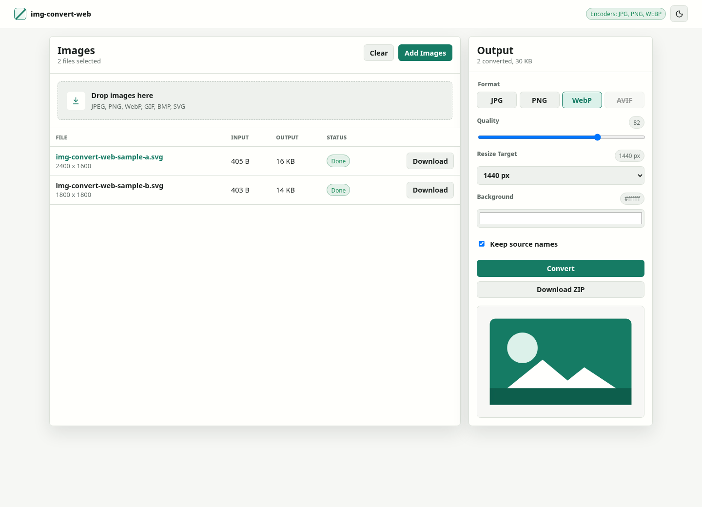
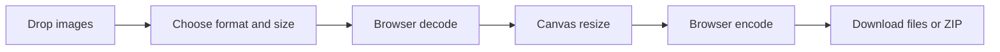

[](https://github.com/fabianwimberger/img-convert-web/actions/workflows/ci.yml)
[](https://opensource.org/licenses/MIT)

# img-convert-web

Private browser image conversion for resizing and exporting images without an upload step.

## Background

Publishing a handful of images should not require a desktop batch tool, a cloud upload, or a full editing suite. `img-convert-web` brings the most common publishing workflow from [img-convert](https://github.com/fabianwimberger/img-convert) into the browser: drop images in, choose the output format and size, then download web-ready files.

<p align="center">
  
  <br><em>Drop images, choose format and size, convert locally, then download files or a ZIP archive</em>
</p>

## Features

- **Private by default** — files are decoded, resized, and encoded in the browser
- **Multiple output formats** — export JPG, PNG, WebP, and AVIF when supported by the browser
- **Flexible resizing** — keep original dimensions, target a short side, or limit total megapixels
- **Custom output controls** — tune lossy quality and choose the JPG background color for transparent images
- **Batch workflow** — convert several images at once and download individual files or one ZIP archive
- **Fast preview** — inspect the selected image before and after conversion
- **Static hosting** — runs from GitHub Pages without a backend service
- **Light and dark themes** — matches the desktop [img-convert](https://github.com/fabianwimberger/img-convert) visual style

## Live App

Use the hosted app at [fabianwimberger.github.io/img-convert-web](https://fabianwimberger.github.io/img-convert-web/).

## Quick Start

```bash
# Clone the repository
git clone https://github.com/fabianwimberger/img-convert-web.git
cd img-convert-web

# Serve the static app locally
python3 -m http.server 8000 --directory docs
```

Open `http://localhost:8000`.

## How It Works



Image data stays on the local device. Available output formats depend on the browser's canvas encoder support, so unsupported formats are disabled automatically.

## Configuration

No environment variables are required.

| Variable | Default | Description |
| -------- | ------- | ----------- |
| N/A      | N/A     | Static GitHub Pages deployment from `docs/` |

## Contributing

See [CONTRIBUTING.md](CONTRIBUTING.md). Please report security issues privately; see [SECURITY.md](SECURITY.md).

## License

MIT License — see [LICENSE](LICENSE) file.

### Third-Party Licenses

| Component | License | Source |
| --------- | ------- | ------ |
| None      | N/A     | N/A    |
